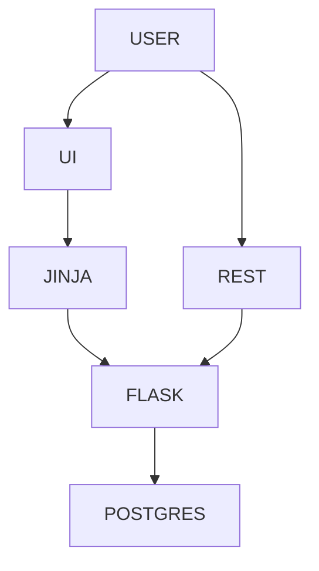
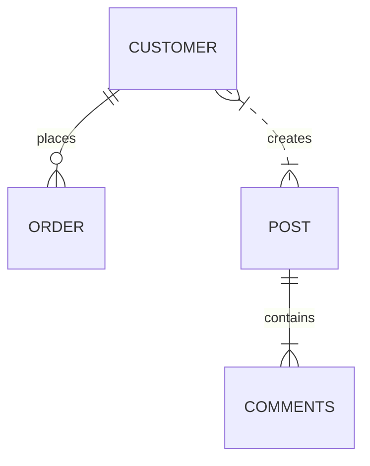

(for markdown diagram formatting see [here](https://mermaid.js.org/syntax/flowchart.html))

# Overview

## Architecture

## Entities

## Start Servers

1. Start and verify Flask server:
   1. `bin/run.sh`
   1. `curl --location 'http://127.0.0.1:5000/health'`
   1. Browser: http://127.0.0.1:5000/web/
1. Start the React server
   1. `cd test-react-app`
   1. `npm run dev`
   1. Browser: http://localhost:5173/

# Setup

## Prerequirements

1. Python
   1. is installed?
      1. `which python` or `which python3`
      1. `python -V` or `python3 -V`
      1. Tip: nice alias to add:
         1. `alias python="python"`
   1. No? Ex for OSX:
      1. https://www.python.org/downloads/macos/
      1. `which python3`
      1. .bashrc or .profile: `export PATH=/Library/Frameworks/Python.framework/Versions/3.12/bin:$PATH` (or whatever the result of which command)
      1. .bashrc or .profile: `export PYTHONPATH=./`
1. Node
   1. Is installed?
      1. `node --version`
   1. No?
      1. `nvm install --lts`
      1. `npm --version`
      1. `node --version`
1. Postgres
   1. Easy install https://postgresapp.com/
   1. Create the db
       1. `CREATE DATABASE flask_db;`
       1. `CREATE USER flask_user WITH PASSWORD 'flask_password';`
       1. `ALTER DATABASE flask_db OWNER to flask_user;`
       1. `GRANT ALL PRIVILEGES ON DATABASE flask_db TO flask_user;`
       1. `GRANT ALL ON ALL TABLES TO flask_user;`
   1. Test the connection
1. Github
   1. Create ssh keys to authenticate with github.  Ex:
       1. `ssh-keygen -t ed25519 -C "you@email.com"`
       1. `eval "$(ssh-agent -s)"`
       1. `ssh-add ~/.ssh/id_ed2551911`
    1. Clone this repo
       1. `git clone git@github.com:harpuna/scratch.git`

## Build

1. Install requirements
   1. `pip install -r requirements.txt`
1. create the tables
   1. `PGPASSWORD=flask_password psql -U flask_user -d flask_db -a -f create_customer_and_order_tables.sql`
   1.

# Developing

## Maintenance

1. Adding a new lib, ex:
   1. `pip install flask flask-sqlalchemy psycopg2-binary`
   1. `pip freeze > requirements.txt`
   1. `pip install -r requirements.txt`
