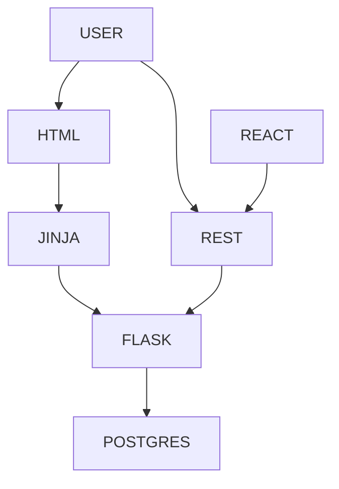
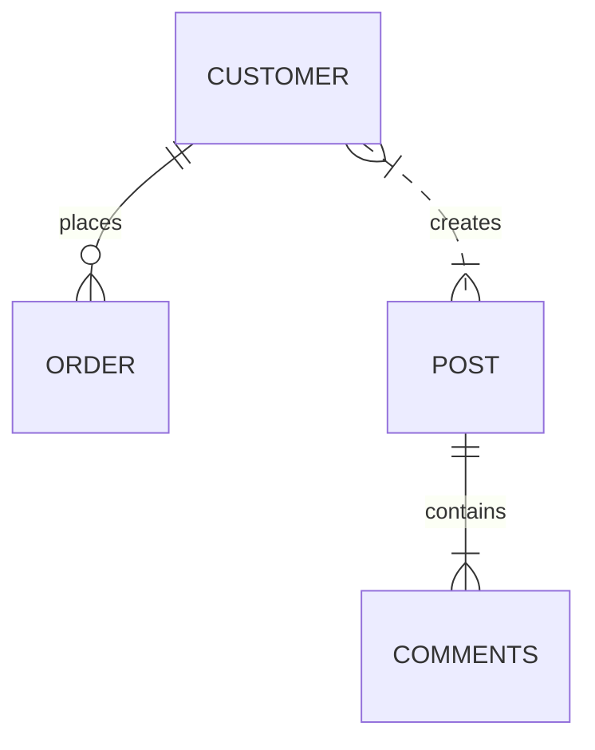

(for markdown diagram formatting see [here](https://mermaid.js.org/syntax/flowchart.html))

# Overview

## Quickstart

1. Run unit tests:
   1. `bin/tests.sh`
1. Start and verify Flask server:
   1. `bin/run.sh`
   1. `curl --location 'http://127.0.0.1:5000/health'`
1. Verify Swagger and the web app:
   1. Browser: http://127.0.0.1:5000/swagger-ui
   1. Browser: http://127.0.0.1:5000/web
1. Start the React server
   1. `cd test-react-app`
   1. `npm run dev`
   1. Browser: http://localhost:5173/


## Architecture




## Interesting Code

`app.py`

- create_app
  - all the initialization of the Flask App
- logger()
  - singleton to return custom logger which all the code should use
  - do not use `app.logger` directly
    - ex:
    ```
    from app import logger
    logger().info("Info message")
    ```
  - custom logger provides a `bind()` function to dynamically add log message attributes
    - ex:
    ```
    from app import logger
    logger().bind(all_customers_count=len(customers))
    ```
  - Best Practices:
    - do not explicitly log any messages (info(), warning() etc)
    - rather, bind() whatever you want
    - all Flask responses will automatically create a single log message, which will include all bound values as attributes

`models/base.py`

- provides common CRUD operations inherited by all other model classes


`conf/.env` files

- environment-specific config values
- which file will be used? Based on the ENVIRON var, ex: `export ENVIRON=test`


##### TODO: add more interesting code...


## Entities

<details>
  <summary><i>CLICK HERE TO EXPAND / COLLAPSE</i></summary>



</details>

# Setup

## Prerequirements

<details>
  <summary><i>CLICK HERE TO EXPAND / COLLAPSE</i></summary>

1. Python
   1. is installed?
      1. `which python` or `which python3`
      2. `python -V` or `python3 -V`
      3. Tip: nice alias to add:
         1. `alias python="python"`
   2. No? Ex for OSX:
      1. https://www.python.org/downloads/macos/
      2. `which python3`
      3. .bashrc or .profile: `export PATH=/Library/Frameworks/Python.framework/Versions/3.12/bin:$PATH` (or whatever the result of which command)
      4. .bashrc or .profile: `export PYTHONPATH=./`
2. Node
   1. Is installed?
      1. `node --version`
   2. No?
      1. `nvm install --lts`
      2. `npm --version`
      3. `node --version`
3. Postgres
   1. Easy install https://postgresapp.com/
   2. Create the db
       1. `CREATE DATABASE flask_db;`
       2. `CREATE USER flask_user WITH PASSWORD 'flask_password';`
       3. `ALTER DATABASE flask_db OWNER to flask_user;`
       4. `GRANT ALL PRIVILEGES ON DATABASE flask_db TO flask_user;`
       5. `GRANT ALL ON ALL TABLES TO flask_user;`
   3. Test the connection
4. Github
   1. Create ssh keys to authenticate with github.  Ex:
       1. `ssh-keygen -t ed25519 -C "you@email.com"`
       2. `eval "$(ssh-agent -s)"`
       3. `ssh-add ~/.ssh/id_ed2551911`
    2. Clone this repo
       1. `git clone git@github.com:harpuna/scratch.git`

</details>

## Build

1. Install requirements
   1. `pip install -r requirements.txt`
1. create the tables
   1. `PGPASSWORD=flask_password psql -U flask_user -d flask_db -a -f create_customer_and_order_tables.sql`


# Developing

## Maintenance

1. Adding a new lib
   1. ex: `pip install flask flask-sqlalchemy psycopg2-binary`
   1. `pip freeze > requirements.txt`
   1. `pip install -r requirements.txt`
   1. `pipenv lock`
